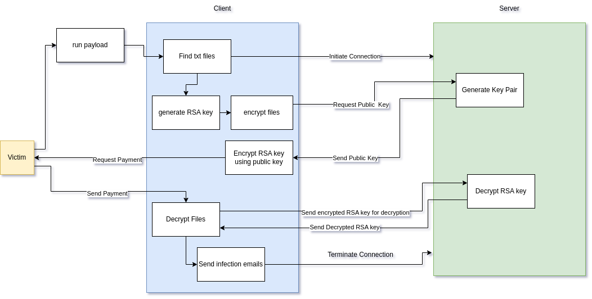
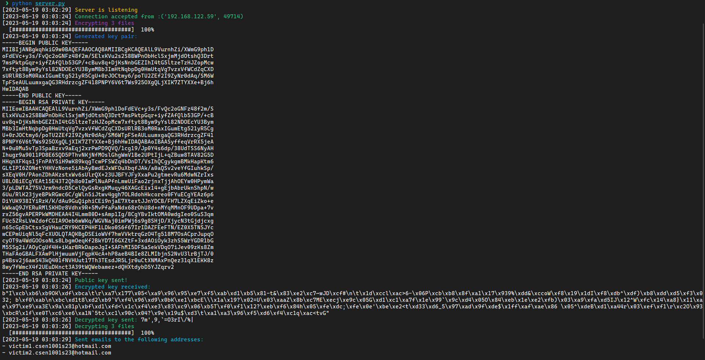
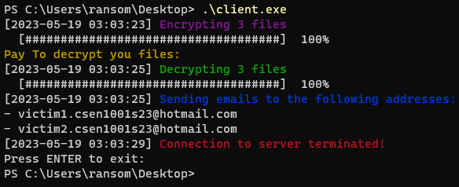

# Network and Computer Security Project
This is the report for the Computer and Network Security. The code consits of 2 files, the client code ```client.py``` and server code ```server.py```.

## Team
- Youssef Ahmed Abdelghafour 
  - ID: 46-2459
  - Tutorial: T-15
- Abdelkareem Tarek Abdelkareem Hassan
  - ID: 46-2195
  - Tutorial: T-14
- Mostafa Mohamed Aly Sharaf
  -  ID: 46-2690
  - Tutorial: T-22
- Ahmed shamel
  - ID:46-1819
  - Tutorial: T-10

---

- [Team _El Joker_](#team-el-joker)
- [Block Diagram](#block-diagram)
- [Requirements](#requirements)
- [Server](#server)
  - [Initialization](#initialization)
  - [Listening](#listening)
  - [Connection](#connection)
    - [receive\_data](#receive_data)
  - [Processing](#processing)
- [Client](#client)
  - [Initialization](#initialization-1)
  - [Connection](#connection-1)
  - [Detection](#detection)
  - [Encrypting the Files](#encrypting-the-files)
  - [Encrypting the Key](#encrypting-the-key)
  - [Decrypting the Files](#decrypting-the-files)
  - [Infection](#infection)
- [Running the Code](#running-the-code)
  - [Example](#example)
    - [Server](#server-1)
    - [Client](#client-1)

## Block Diagram


## Requirements
None standard Python modules are listed in ```requirements.txt``` run the command
```bash
pip install -r requirements.txt
```
- ```pycryptodome``` 
- ```pandas``` 
- ```pyinstaller``` 
-  ```requests``` 

## Server
### Initialization
Firstly, some global variable are initialized

- ```SERVER_IP``` the IP that the server will bind to
- ```SERVER_PORT``` the port that the server will use
- ```MESSAGE_TYPES``` a list of the data types that are accepted by the server
- ```HEADER_LENGTH``` the predefined length of the header 
  - 16 bytes uuid of the client
  - 3 bytes the type of message
  - 4 bytes int representing lenth of the message

### Listening
A socket is opened using the library ```socket```, and start listening for incoming connections from the client.

### Connection
When a connection is established the server starts receiving messages from the client using the function [```receive_data```](#receive_data).

#### receive_data

- input
  - ```conn``` the connection object
- outputs
  - ```unique_id``` the uuid of the client extracted from the header
  - ```data_type``` the type of the message
  - ```data``` the contents of the message

It first extracts the uuid of the client from the header. Then the type of the message, and the length of the message converted from 4 bytes to an int. Finally the message is received, and all returned. 

### Processing
In a for loop the each time a message is received, it is processed according it it's type
 ```PUB```, ```ENK```, ```TRM```, ```EML```, ```ENC```, ```DEC```.
 
- ```PUB``` 2048 bytes RSA Key Pair is generated using the function ```generate_rsa_key``` using ```pycryptodome``` library. Then the public key is sent to the client.
- ```ENK``` The message received is the  encrypted ```AES``` key generated by the client. Then the key is decrypted using the private key, and sent back to the client.
- ```TRM``` When the message type is TRM the connection is terminated.
- ```EML``` This type's data contains a list of email addresses which the infection email is sent to.
- ```ENC``` and ```DEC``` these types handle the loading bar of the encryption and decryption of files on the client side.

## Client
### Initialization
Firstly, some global variable are initialized

- ```SERVER_IP``` the IP that the server will bind to.
- ```SERVER_PORT``` the port that the server will use.
- ```MESSAGE_TYPES``` a list of the data types that are accepted by the server.
- ```HEADER_LENGTH``` the predefined length of the header 
  - 3 bytes the type of message
  - 4 bytes int representing length of the message 
- ```URL``` the link to the CSV file containing a list of emails.
- ```EMAIL_ADDRESSES``` The email used to send from.
- ```EMAIL_PASSWORD``` The app password for the email.

### Connection
First of all a connection to the server is initiated

### Detection
The function ```get_files``` searches a given path for ```.txt``` files, and returns a list of paths. This function uses ```Pathlib``` glob function ```path.glob(f'**/*.{ext}')``` where ext is the extension of the files.

### Encrypting the Files
Firstly a random 128 bit random key is generated using the function ```generate_key``` with an input the length of the key. Then the files are encrypted using ```encrypt``` function and the progress is sent to the server.

### Encrypting the Key
A request is sent to the server with the type ```PUB```. The public key is received from the server using  [```receive_data```](#receive_data) function explained in the server part. The key is then encrypted using the public key.

### Decrypting the Files
When the input simulating the victim paying is done, the encrypted key is sent to the server. The key is decrypted using the private key on the server, and sent back. Then the files are decrypted using the ```decrypt``` function and the progress is sent to the server.

### Infection
The function ```send_email``` sends an email to a list of emails read from the CSV file ```URL```. The email contains a link to the  ```client.exe``` file. The email is sent using the ```smtplib``` library.

## Running the Code
Firstly, the server is run using the command _(all operations are printed to the terminal)_
```bash
python server.py
```
The ```client.py``` is compiled using ```pyinstaller``` library using the command
```bash
pyinstaller --onefile --console client.py
```
Then the ```client.exe``` is run on the victim's computer. The victim is asked to pay a ransom, and when the payment is done the ```client.exe``` decrypts the files, and sends the emails.

### Example
The following is an example of the output of the server and the client.

#### Server


#### Client

